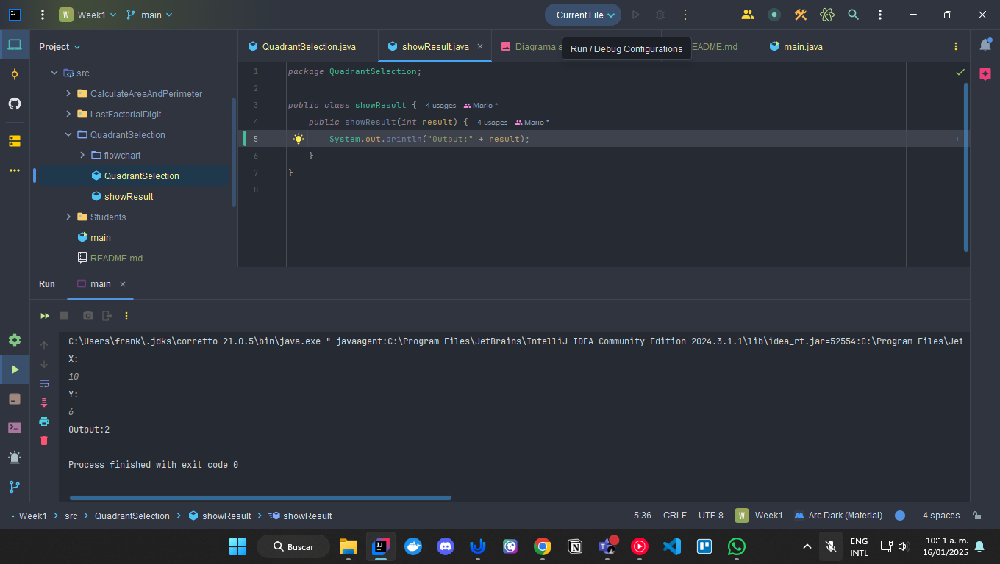
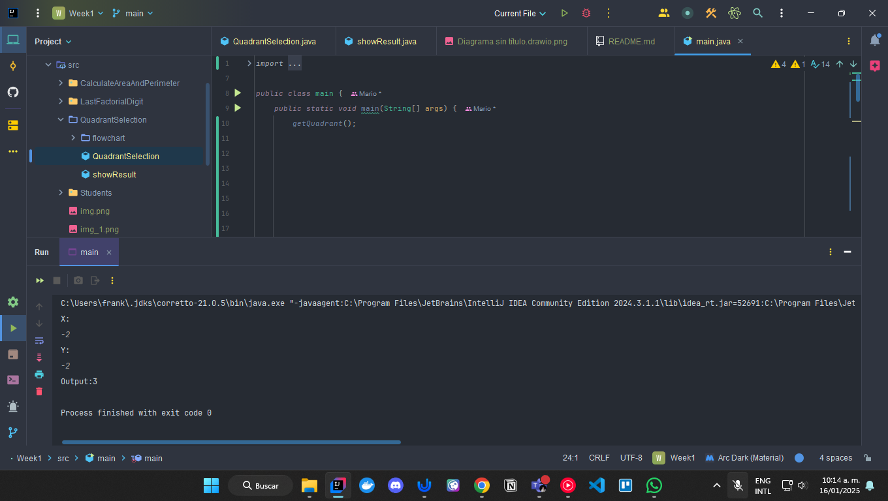
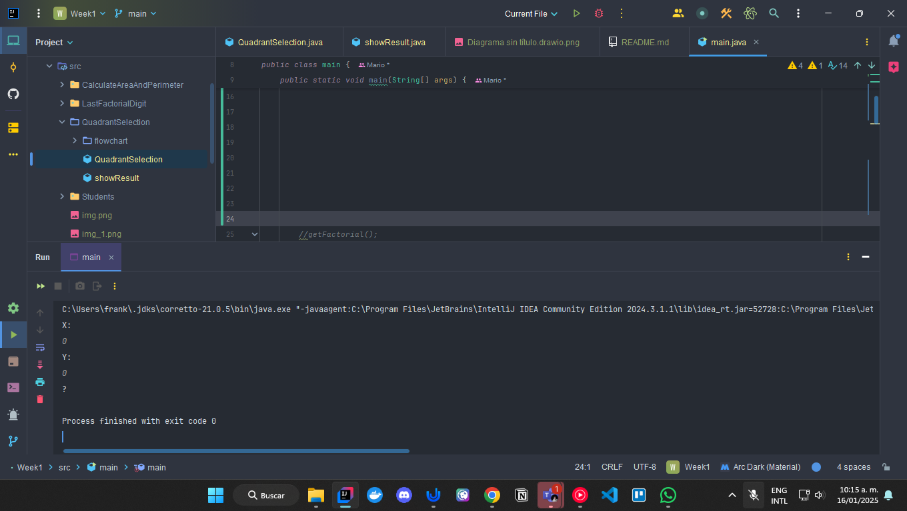
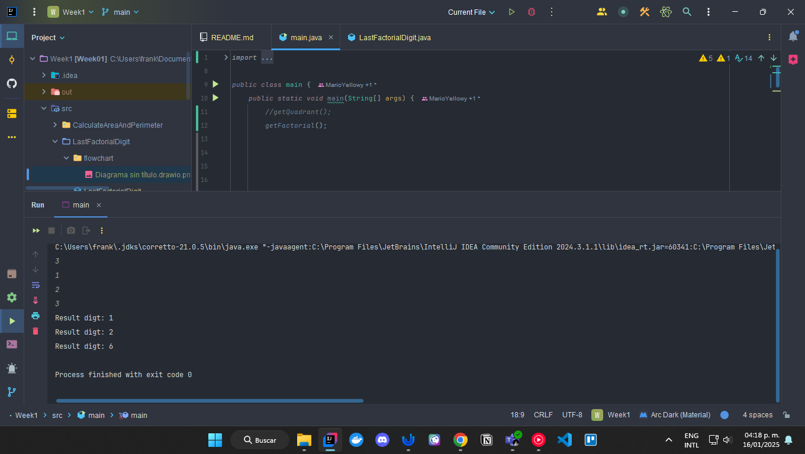
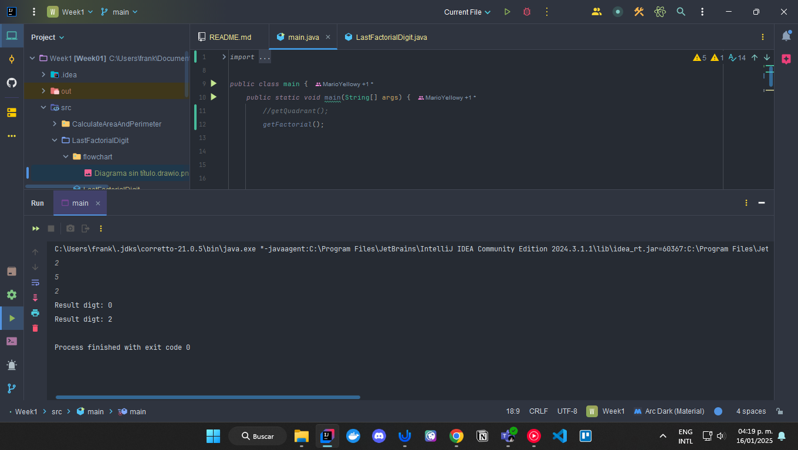
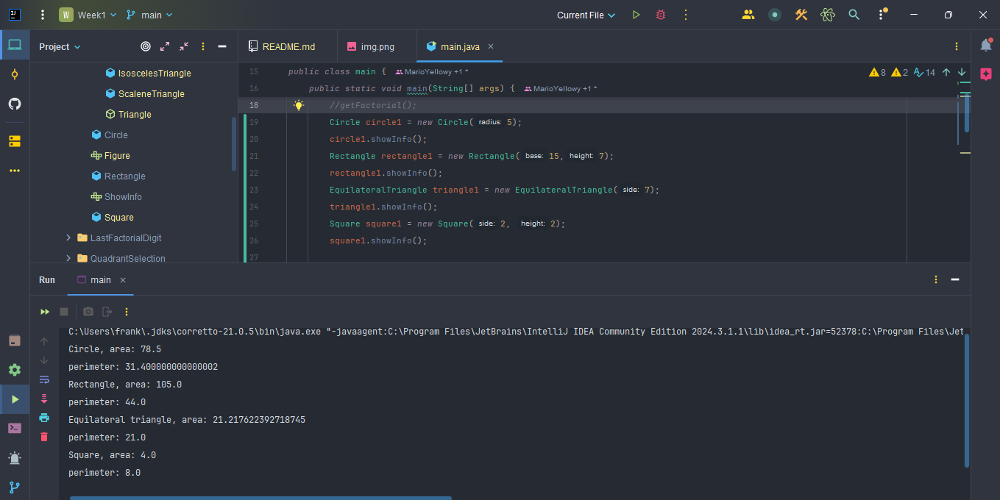

# Actividad 1

## Quadrant Selection
Se realizo el flowchart en draw.io:

Caso de prueba 1: 

Caso de prueba 2:

Caso de prueba 3:

Caso de prueba 4:

Caso de prueba 5:

# Last Factorial digit

Se realizo el flowchart en draw.io

Caso de prueba 1:

Caso de prueba 2:

# Actividad 2

# OPP Introduction

Caso de prueba:

